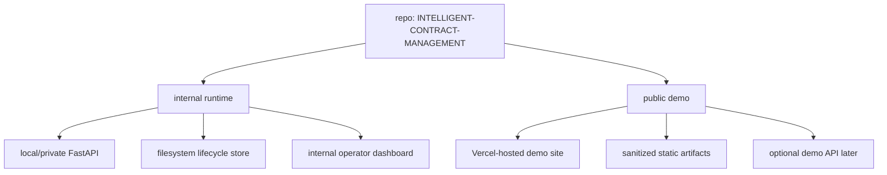

# Deployment Split Plan

This repository should be deployed as two separate surfaces, not one.

## Recommendation

Use Vercel for the public demo only. Keep the real contract-intelligence
runtime separate.

The current codebase is a Python and `uv`-managed system built around:

- the shared `ese` orchestration engine
- a local FastAPI layer in `apps/contract_intelligence/api/`
- filesystem-backed lifecycle state
- generated internal and external dashboard artifacts

That makes it a good fit for:

- a local or private operator environment for real use
- a static or thin-frontend public demo

It is not a good fit for exposing the current internal runtime directly as a
public Vercel app.

## Target topology



## Recommended environments

### 1. Internal operator environment

Purpose:

- real bid review
- real uploads
- real monitoring
- real review actions
- real persisted lifecycle state

Recommended hosting:

- local workstation or secured internal host first
- later: private VM, Render, Fly.io, Railway, or another Python-friendly host

Characteristics:

- uses `uv sync --locked`
- runs the FastAPI layer and CLI
- keeps `.contract_intelligence/` project state private
- may render internal dashboards
- may use live model adapters and real credentials

Suggested internal domains later:

- `icm-internal.<your-domain>`
- `api-internal.<your-domain>`

### 2. Public demo environment

Purpose:

- show the product
- explain workflow
- demonstrate outputs safely
- optionally let users inspect prebuilt demo cases

Recommended hosting:

- Vercel

Characteristics:

- read-only by default
- no real customer/project uploads at first
- no internal context artifacts
- no writable review actions
- no live filesystem-backed case store

Suggested public domains:

- `demo.<your-domain>`
- or `icm-demo.<your-domain>`

### 3. Optional demo API environment

Only add this if you want interactive uploads or guided sample analysis.

Purpose:

- limited, sandboxed demo uploads
- temporary jobs against demo-only cases
- strictly separated from internal data

Recommended hosting:

- separate backend deployment from Vercel frontend

Suggested domain:

- `api-demo.<your-domain>`

## What should run where

### Safe for Vercel now

- marketing/demo landing page
- architecture overview
- workflow explainer
- static screenshots
- pre-rendered external dashboards from demo data
- sample sanitized findings and negotiation summaries

### Not appropriate for Vercel as-is

- the internal FastAPI operator surface
- the real lifecycle store
- filesystem-backed monitoring state
- internal dashboards
- server-backed review actions against real cases

## Data separation rules

This split only works if the environments are intentionally separated.

### Public demo rules

- demo data only
- no customer data
- no real contract packages
- no internal-only context profiles
- no review-action history from internal projects
- no local file paths in payloads or rendered output

### Internal runtime rules

- trusted users only
- real project folders allowed
- real review actions allowed
- real monitoring state allowed
- internal and external dashboard generation both allowed

## Demo artifact strategy

The fastest safe demo path for this repo is:

1. build one or more curated sample projects in `apps/contract_intelligence/corpus/`
2. run lifecycle commands locally
3. render sanitized external dashboards
4. publish those artifacts through a Vercel-hosted demo shell

That gives you:

- a beautiful public demo
- zero exposure of internal operator paths
- no need to expose the current Python backend publicly

## Suggested domain model

Use subdomains by audience, not by branch.

- `demo.<your-domain>`: public product demo
- `app.<your-domain>` or `internal.<your-domain>`: private operator app later
- `api-demo.<your-domain>`: optional public demo API later
- `api.<your-domain>` or `api-internal.<your-domain>`: private backend later

Do not use one shared hostname for both the internal operator runtime and the
public demo.

## Branch and deployment policy

Recommended policy:

- `main` remains the source of truth for the codebase
- Vercel deploys only the demo surface
- internal runtime deploys from the same repo, but through a separate deploy target

This avoids creating a second product fork just for demo hosting.

## Near-term implementation plan

### Phase 1: Public demo shell

Build a small Vercel-friendly frontend that presents:

- product overview
- sample lifecycle walkthrough
- links to pre-rendered sanitized dashboard artifacts
- screenshots and sample findings

This can be static HTML or a small Next.js app.

This now exists in [`demo_site/`](/Users/billp/Documents/GitHub/INTELLIGENT-CONTRACT-MANAGEMENT/demo_site).
Refresh the assets with:

```bash
uv run python -m apps.contract_intelligence build-demo
```

### Phase 2: Demo content pipeline

Add a repeatable process that:

- regenerates demo artifacts from curated sample projects
- copies sanitized HTML and JSON into a demo export directory
- publishes only those assets

This now exists through the `build-demo` command, which writes:

- Vercel-facing static assets to `demo_site/generated/`
- Render/reference workspaces to `artifacts/contract_intelligence_reference/` by default

### Phase 3: Private runtime deployment

Stand up the internal FastAPI + CLI environment on a Python-friendly host.

This now has an initial Render blueprint in
[`render.yaml`](/Users/billp/Documents/GitHub/INTELLIGENT-CONTRACT-MANAGEMENT/render.yaml)
and a startup bootstrap script in
[`scripts/start_icm_reference.sh`](/Users/billp/Documents/GitHub/INTELLIGENT-CONTRACT-MANAGEMENT/scripts/start_icm_reference.sh).

### Phase 4: Optional interactive demo API

Only after the public demo is stable:

- introduce short-lived demo uploads
- isolate storage completely from internal state
- use stricter quotas and stripped-down features

## Repo-specific recommendation

For this repository today, the best immediate path is:

1. keep `apps/contract_intelligence` as the real internal runtime
2. create a separate Vercel demo surface that consumes sanitized demo artifacts
3. avoid exposing the current internal FastAPI service on the public internet

That gives you a clean story:

- Vercel is the showroom
- the Python app is the workshop
- the real operator workflow stays protected
